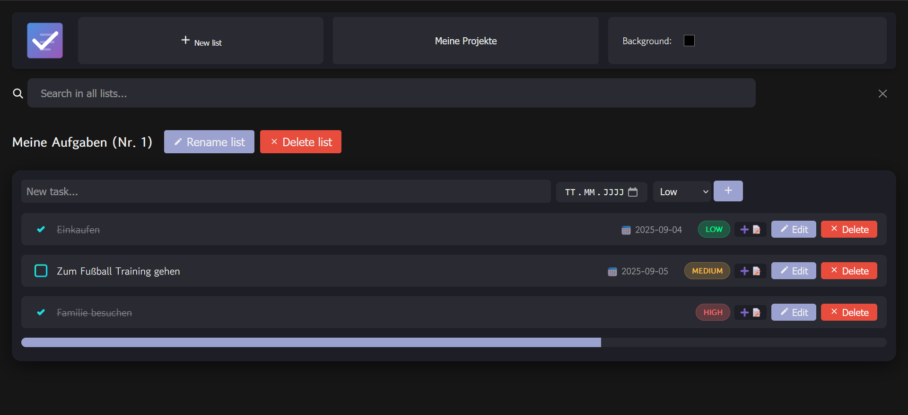

# Todo

A simple, user-friendly Todo web application with all the features you need to manage daily tasks: add, edit, complete, add a date, add notes, edit notes, add priotry, edit priotry, see checked, unchecked and the overall number of to-dos and remove tasks and add todo lists, edit them or remove. Coming soon is the option that you can see the date the todo was created.

## Table of contents

- [Features](#features)
- [Screenshot](#screenshot)
- [Demo](#demo)
- [Install](#install)
- [Usage](#usage)
- [Development](#development)
- [Built with](#built-with)
- [Contributing](#contributing)
- [License](#license)
- [Contact](#contact)

## Features

- Add new tasks with a title (and optional details).
- Edit existing tasks.
- Mark tasks as completed / uncompleted.
- Delete tasks.
- Simple, responsive UI built with HTML, CSS, and JavaScript.

## Screenshot



## Demo

- Live demo: https://lkatze22.github.io/todo/index.html

## Install

1. Clone the repository:

   ```bash
   git clone https://github.com/LKatze22/todo.git
   cd todo
   ```

2. Open index.html in your browser or serve the folder with a simple static server:

   ```bash
   npx http-server .
   # or
   python -m http.server
   ```

## Usage

- Open the app in a browser.
- Use the input to add tasks and optional details like priority.
- Click a task to edit or mark as complete.
- Use the delete button to remove tasks.

## Development

- The project uses plain HTML, CSS, and JavaScript. No build step required.
- If you add dependencies or a build tool, describe steps here.

## Built with

- JavaScript (~56%)
- CSS (~29%)
- HTML (~15%)

(Percentages are approximate and based on the repository language composition.)

## Contributing

Contributions are welcome. To contribute:

1. Fork the repository.
2. Create a feature branch: `git checkout -b feature/your-feature`.
3. Commit your changes and push: `git push origin feature/your-feature`.
4. Open a pull request describing your changes.

Please follow standard git and PR practices.

## License

Apache 2.0

## Contact

Created by LKatze22 — feel free to open an issue or pull request with questions or improvements.
